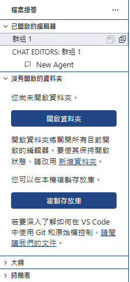

📁 Explorer  
🔍 Search  
🌿 Source Control  
🤖 Cursor/Chat  
🧠 Agents  
🐞 Run and Debug  
🧩 Extensions  
📊 Testing  
📦 Remote Explorer  

以下是**依據你提供的畫面內容（AI Cursor 開機／首頁畫面，上方第一排中間區域）**，對 **左邊那張圖、Cursor、Agents Window** 的**名稱與功能說明**。我會以「**畫面上可辨識的元素**＋**Cursor 官方實際功能定位**」來解釋，讓你一看就能對得上畫面。

***

## 一、畫面整體位置說明（幫助你對焦）

你提到的位置是：

> **AI Cursor 開機畫面 → 上面第一排 → 中間位置**

畫面上可看到三個並列的項目，**由左到右分別是：**

1.  ✅ 左邊那張圖（功能示意圖）
2.  ✅ Cursor
3.  ✅ Agents Window

***

## 二、左邊那張圖（功能示意圖）

### 📛 名稱（非按鈕，而是示意圖）

**Cursor 編輯器操作示意圖（Editor + AI Assist 示意）**

> 這張圖不是實際可點擊的功能，而是 **用來說明 Cursor 能做什麼** 的視覺教學圖。

 Toggle primary Side Bar (Ctrl+B)
 
左邊會出現'主要側邊欄'，管理與探索整個專案與 AI 能力的核心入口。

一、Primary Side Bar 的名稱是什麼？
✅ 正式名稱
Primary Side Bar（主要側邊欄）
在 Cursor（延續 VS Code 的設計）中，它也常被稱為：

Side Bar
Activity Bar（活動列）＋ Side Bar（內容區） 的組合

左邊最外側的一排圖示是 Activity Bar
點擊後展開的實際功能內容區就是 Primary Side Bar

二、Primary Side Bar 的主要功能是什麼？
Primary Side Bar 是你在 Cursor 裡管理與探索整個專案與 AI 能力的核心入口。

三、Primary Side Bar 裡常見的功能與說明
1️⃣ Explorer（檔案總管）
📁 專案 / 檔案管理
功能：

瀏覽整個專案資料夾
開啟、建立、刪除檔案
拖拉調整資料夾結構

用途一句話：

管理專案結構的地方

2️⃣ Search（搜尋）
🔍 跨檔案搜尋
功能：

搜尋整個專案的文字
支援正則表達式
可取代多個檔案內容

用途一句話：

快速找出程式碼在哪裡被用到

3️⃣ Source Control（版本控制）
🌱 Git 版本控管
功能：

檢視修改的檔案
Commit / Push / Pull
與 GitHub / GitLab 整合

用途一句話：

管理程式碼版本與變更紀錄

4️⃣ Cursor / Chat / AI（Cursor 特有）
🤖 AI 對話與輔助功能
功能（依版本略有不同）：

與 AI 對話
針對專案提問
解釋或修改程式碼
呼叫 AI 建議

用途一句話：

把 AI 當成「會看你整個專案的工程師」

5️⃣ Extensions（擴充套件）
🧩 功能擴充
功能：

安裝新語言支援
安裝主題、格式化工具
加強 AI、Lint、Debug 功能

用途一句話：

讓 Cursor 變成你想要的工作環境

四、Primary Side Bar 在 Cursor 的「角色定位」
🧠 它的本質是什麼？

負責「探索、管理、切換上下文」的地方

不是寫程式的地方，而是：

管「檔案」
管「專案」
管「AI 入口」
管「工具與狀態」

五、和 Editor / Agents Window 的關係對照

區域功能角色Primary Side Bar探索與管理Editor（中央）寫程式、看內容Agents WindowAI 主動處理複雜任務

***

### 🧩 圖中通常代表的功能含義

這張圖常見會包含：

*   **程式碼編輯畫面**
*   **AI 在程式碼旁邊提示、補齊或改寫**
*   游標（Cursor）正在某一段程式碼上

✅ 傳達的重點是：

> **「Cursor 是一個以程式碼為中心、AI 與編輯器深度整合的 IDE」**

***

### 🎯 核心功能意義

| 問題        | 這張圖在說什麼                   |
| --------- | ------------------------- |
| 它是不是功能按鈕？ | ❌ 不是                      |
| 有沒有點擊行為？  | ❌ 沒有                      |
| 主要用途？     | ✅ 視覺化說明 Cursor 的 AI 寫程式能力 |

***

## 三、Cursor（中間文字「Cursor」）

### 📛 名稱

**Cursor（主編輯器 / AI Code Editor）**

***

### 🧠 功能定位

這代表的是 **Cursor 的「核心工作區」**，也就是：

> **你實際寫程式、看檔案、修改專案的地方**

***

### 🔧 Cursor 主要功能

在 Cursor 編輯器中，你可以：

*   ✏️ 編輯程式碼（如 Python、JavaScript、SQL、Shell…）
*   🤖 直接對選取的程式碼：
    *   解釋程式
    *   改寫 / 重構
    *   找 Bug
    *   產生測試程式
*   ⌨️ 使用快捷鍵：
    *   `Cmd / Ctrl + K` 召喚 AI 對話改碼
    *   `Cmd / Ctrl + L` 對整個檔案提問

***

### 🧩 重點一句話

> **Cursor =「AI 強化版的 VS Code 編輯器本體」**

***

## 四、Agents Window（右邊「Agents Window ↗」）

### 📛 名稱

**Agents Window（AI 代理人視窗）**

***

### 🧠 功能定位

Agents Window 是：

> **讓 AI「以角色／代理人方式」協助你完成多步驟任務的專用視窗**

而不是只回答單一問題。

***

### 🧑‍💻 Agents 能做什麼？

Agents 比一般聊天 AI 更進一步，可以：

*   📁 理解**整個專案結構**
*   🔄 跨檔案修改程式
*   🧪 自動補測試
*   🧹 修 bug + 調整架構
*   📜 依你的需求，連續執行多個動作

***

### 🔍 與 Cursor 編輯器的差異

| 項目   | Cursor   | Agents Window |
| ---- | -------- | ------------- |
| 使用方式 | 人主導、逐段詢問 | AI 主導、連續執行    |
| 範圍   | 單段或單檔    | 整個專案          |
| 適合情境 | 寫程式、理解程式 | 重構、修 Bug、大改動  |

***

### ↗ 箭頭的意思

「**↗**」表示：

> **Agents Window 可以獨立開啟 / 放大成主要操作視窗**

***

## 五、三者關係一句話總結 ✅

> **左邊那張圖**：告訴你 Cursor 能做到什麼  
> **Cursor**：你實際寫程式、控制 AI 的主編輯器  
> **Agents Window**：讓 AI 像「資深工程師代理人」一樣自動幫你做事

***

如果你願意，我也可以下一步幫你做：

*   ✅ **用實際例子說「什麼情況用 Cursor、什麼情況用 Agents」**
*   ✅ **幫你畫一個文字版流程圖（適合內訓或文件）**
*   ✅ **用你們生技部常見的分析 / Script 情境來示範用法**

你比較想往哪一個方向？
