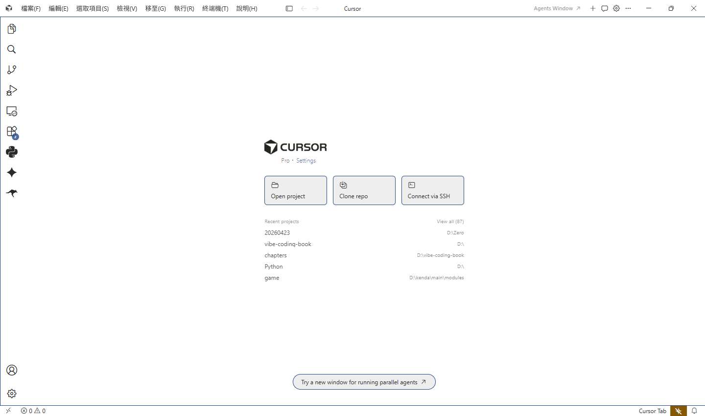
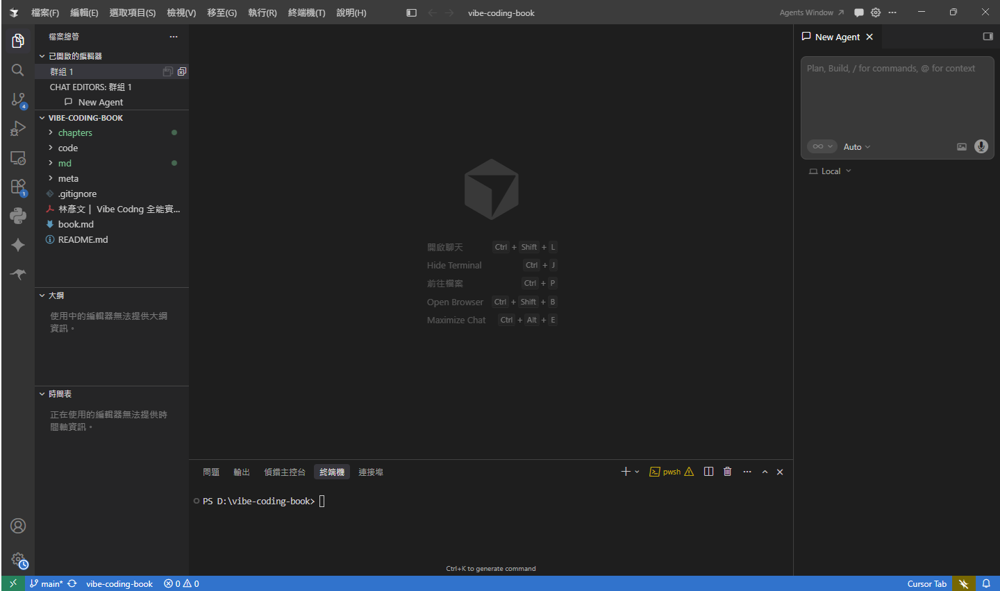

<table style="width: 100%; border-collapse: collapse;">
  <tr>
    <td style="width: 50%; text-align: left;">
      
      
圖 02-00.AI-Cursor-開機畫面

    </td>
    <td style="width: 50%; text-align: right;">
      
      
圖 02-01.AI-Cursor-開機畫面

    </td>
  </tr>
</table>

### 1. 上圖是 AI Cursor（基於 VS Code 的 AI 編輯器）的檔案總管中的一個資料夾清單畫面。
包括
- 資料夾名稱是 CHAPTERS 
 - 資料夾 CHAPTERS 裏頭有
    - 子資料夾
    - 圖片檔（.png）
    - Markdown 文件（.md）
 - 檔案在 Git 版本控制中的狀態
 不只是「檔案列表」，而是一個「結合 Git 狀態提示的檔案總管」。

  最上層：📁 CHAPTERS 是一個資料夾（目錄）左邊的 ▾（向下的小箭頭） 表示：此資料夾目前是 展開狀態點擊後可收合（▸）
  ---
  ### 1. 上圖是 AI Cursor（基於 VS Code 的 AI 編輯器）的檔案總管中的一個資料夾清單畫面。